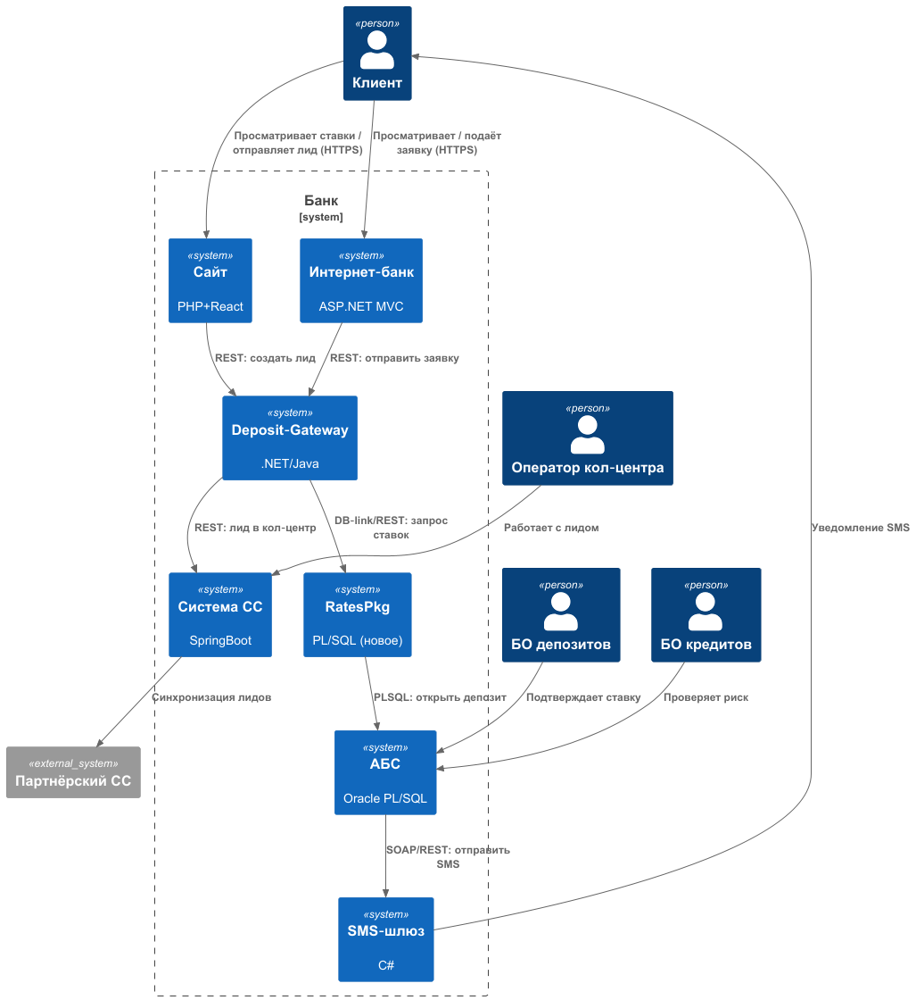
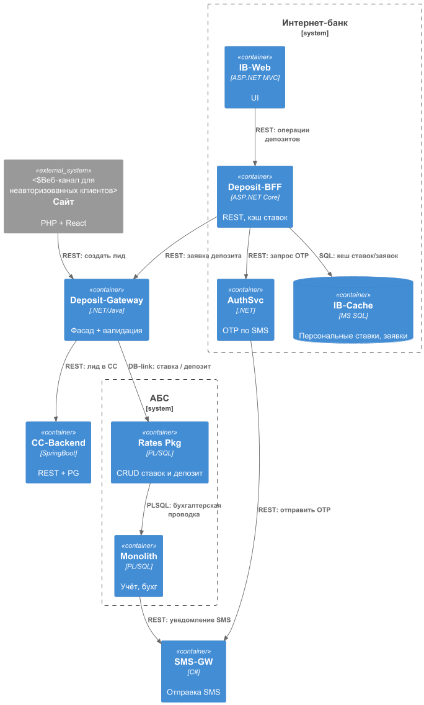

### **Название задачи:** MVP «Открытие депозитов онлайн»

### **Автор:** Калинов П.М.

### **Дата:** 03 мая 2025

---

### **Функциональные требования**

| **№** | **Действующие лица или системы** | **Use Case**                 | **Описание**                                                                                                                                                                        |
| :---: | :------------------------------- | :--------------------------- | :---------------------------------------------------------------------------------------------------------------------------------------------------------------------------------- |
|  UC‑1 | Клиент → Сайт                    | Просмотр публичных депозитов | 1. Клиент открывает страницу «Депозиты». 2. FE запрашивает публичные ставки в Deposit‑Gateway. 3. Клиент видит список продуктов и ставок.                                     |
|  UC‑2 | Клиент → Сайт                    | Подача заявки (лид)          | 1. Клиент заполняет ФИО и телефон. 2. FE вызывает `createLead()` в Deposit‑Gateway (TLS). 3. Gateway сохраняет лид и передаёт в Систему кол‑центра.                           |
|  UC‑3 | Оператор CC → Система CC         | Обработка лида               | 1. Оператор видит лид, звонит клиенту. 2. Может предложить спец‑ставку. 3. Обновляет статус лида.                                                                             |
|  UC‑4 | Клиент → Интернет банк(IB)       | Просмотр персональных ставок | 1. Клиент авторизуется в IB. 2. IB‑BFF запрашивает ставки в кэше. 3. Отображается персональный список.                                                                        |
|  UC‑5 | Клиент → Интернет банк(IB)       | Подача заявки на депозит     | 1. Клиент выбирает счёт, сумму. 2. Получает SMS‑OTP (AuthSvc). 3. IB‑BFF вызывает `submitDeposit()` в Deposit‑Gateway. 4. Gateway создаёт заявку, пишет в Rates Pkg / АБС. |
|  UC‑6 | Менеджер БО депозитов → АБС      | Подтверждение ставки         | 1. Менеджер открывает заявку в АБС. 2. Утверждает ставку. 3. АБС отправляет SMS клиенту («депозит открыт»).                                                                   |

---

### **Нефункциональные требования**

| **№** | **Требование**                                                     |
| :---: | :----------------------------------------------------------------- |
|  NF‑1 | Доступность сайта, IB и SMS ≥ 99,9 % (24 × 7, переключение ЦОД).   |
|  NF‑2 | Средний отклик API < 200 мс, 95‑й < 500 мс; UI ≤ 300 мс.           |
|  NF‑3 | TLS 1.2+ для всех клиент↔сервис и сервис↔сервис каналов.           |
|  NF‑4 | Отсутствие прямых IB→АБС вызовов — Gateway/кэш экранируют Oracle.  |
|  NF‑5 | Горизонтальное масштабирование web‑слоя; АБС — только вертикально. |
|  NF‑6 | Технологии .NET/Java, MS SQL, Oracle; Kafka позже.                 |
|  NF‑7 | Логирование, трассировка, CI/CD, эксплуатационная документация.    |

---

### **Решение**

#### Диаграмма контекста (C4‑level 1)

**Комментарии к диаграмме контекста**

1. Клиент взаимодействует с двумя каналами: публичным сайтом (для лидов) и интернет‑банком (для авторизованных заявок).
2. Бизнес‑логика заявок сосредоточена в новом сервисе **Deposit‑Gateway**, который экранирует АБС и обеспечивает REST‑интеграцию.
3. Кол‑центр получает лиды через существующую **Систему CC**; партнёрский CC синхронизируется отдельно.
4. Новая подсистема **Rates Pkg** в Oracle хранит ставки и создаёт депозит, разгружая монолит АБС.
5. Все SMS‑уведомления идут через отдельный **SMS‑шлюз**.
6. Бэк‑офисные сотрудники работают в АБС: депозиты подтверждают ставку, кредитный отдел — проверку риска.

#### Диаграмма контейнеров (Интернет-банк и АБС)

 

**Комментарии к диаграмме контейнеров**

* **IB‑Web** вызывает *Deposit‑BFF*, который кеширует ставки в **IB‑Cache** для быстрого отклика и обращается в **Deposit‑Gateway** за созданием заявки.
* **AuthSvc** отправляет одноразовый пароль через **SMS‑GW**.
* **Deposit‑Gateway** выполняет валидацию, пишет/читает ставки из *Rates Pkg* и публикует лиды в **CC‑Backend**.
* Внутри **АБС** новый пакет *Rates Pkg* отделяет CRUD ставок/депозитов от тяжёлого монолита *Monolith* (учёт).
* После создания депозита монолит формирует проводку и даёт команду SMS‑шлюзу уведомить клиента.

---

### **Альтернативы**

| Альтернатива       | Плюсы                     | Минусы                                    | Решение   |
| :----------------- | :------------------------ | :---------------------------------------- | :-------- |
| Прямой REST IB→АБС | Простейшая интеграция     | Перегруз Oracle, нарушает NF‑4            | Отклонена |
| Kafka + CQRS сразу | Масштаб, гибкость событий | ИНтернет-банк не поддерживает Kafka, рост сроков | Отложена  |

**Недостатки, ограничения, риски**

- *Rates Pkg* по‑прежнему работает в той же Oracle‑БД — масштабируется вертикально.

- Новый **Deposit‑Gateway** — дополнительный компонент, требует CI/CD и мониторинга.

- SMS‑GW остаётся единственной точкой для уведомлений; нужна High‑Availability.
